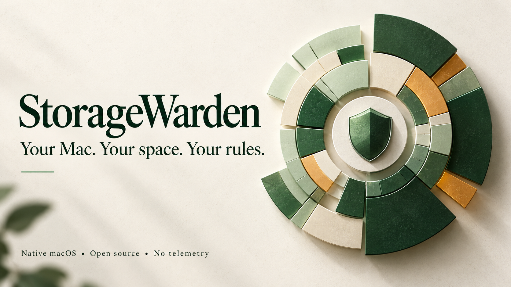
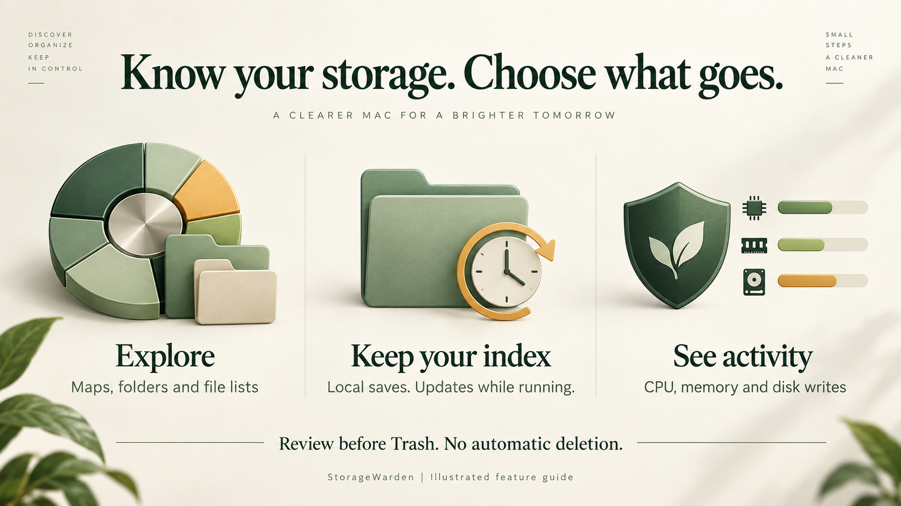

# StorageWarden

[](https://chatgpt.com/)



**Find what is taking up space on your Mac. Decide what to keep.**

StorageWarden is a free, open-source Mac app for exploring your files, reviewing cleanup choices, and seeing which processes are using your Mac's resources.

No subscriptions. No accounts. No ads. No tracking. Free for life under the [MIT license](LICENSE).

## Download and install

**[Download StorageWarden for Mac](https://github.com/Sjayeshkumar/StorageWarden/releases/tag/v0.2.1)**

Requires **macOS 15 or newer**. The DMG supports Apple silicon and Intel Macs. You do not need Xcode to use the download.

1. Download the `.dmg` file from the release page and double-click it.
2. Drag **StorageWarden** onto the **Applications** folder inside the window.
3. Open StorageWarden from Applications, then eject the disk image.
4. Read the short introduction and choose a folder for your first scan.

**Early preview:** this download is ad-hoc signed, not Developer ID signed or notarized by Apple. macOS may block it. Please read the [installation guide](docs/INSTALL.txt) before deciding to open it. Do not disable your Mac's security protections.

## Privacy comes first

**StorageWarden does not send your files, scan results, or activity readings to us or to any server.** Scanning and monitoring happen on your Mac. The app works without an internet connection.

It saves a list of file names, locations, sizes and dates locally so you can reopen a scan. It does not save copies of your file contents. Activity readings are not saved as history.

Website links open separately in your browser. Backups, cloud-synced folders and macOS services follow your own settings; StorageWarden does not control those. Read the [plain-language privacy policy](PRIVACY.md).

## What can I do with it?



| You want to... | StorageWarden helps you... |
| --- | --- |
| Find large files | Browse storage maps, search file lists, and sort by size. |
| Understand a folder | Open it in the app, preview a file, or show it in Finder. |
| Review clutter | Look through downloads, archives, caches and recognized developer files. |
| Remove something | Review eligible files and their warnings before moving them to Trash. Nothing is removed automatically. |
| Avoid starting over | Reopen your last saved scan and update changed folders while the app runs. |
| See what is busy | Click the shield in the menu bar for CPU, memory, disk writes and supported system activity readings. |

*The pictures above are brand illustrations, not screenshots of the app. They contain no personal scan data.*

## Everyday use

**Start small.** Pick a folder you know. You can give the app optional Full Disk Access later to scan more locations.

**Your last scan is remembered.** While the app runs, changed folders are grouped for updates about every two minutes. Automatic updates wait when your Mac is saving power or too hot. Background changes are saved at most every 15 minutes; manual scans and cleanup save immediately. Changes made while the app is quit need a manual rescan. If the app misses change notifications, it tells you a rescan is needed.

**Closing is not quitting.** Close the main window to keep the menu-bar app available. Quit StorageWarden to stop monitoring and background updates. Starting at login is optional in Settings.

**Activity is on demand.** Readings refresh every three seconds while the activity panel is open. Each process is listed separately, including helpers. CPU use can exceed 100% when a process uses more than one core. System GPU readings depend on your Mac; per-app GPU readings are not available.

**Trash is still your choice.** StorageWarden does not empty Trash automatically. Space may not be freed until you empty it yourself.

## What is not ready yet?

This is an early release, not a replacement for every commercial Mac utility.

- Possible duplicates are not confirmed by comparing file contents. Do not treat them as proven copies.
- Complete app uninstall, app updates and extension removal are not implemented. App bundles and related files are reviewed separately.
- There is no malware scanner, fan control or "RAM cleaning."
- Shared files and APFS storage can make size estimates differ from the space actually freed.
- Very large saved scans can still use substantial memory.
- The downloadable preview has not been notarized or tested on every supported Mac.

## For developers

Built with Swift 6 and SwiftUI, with no third-party dependencies. Use Xcode 16 or newer.

1. Open `StorageWarden.xcodeproj`.
2. Select the **StorageWarden** scheme and **My Mac**.
3. Run. The scheme uses an optimized Release build.

```sh
xcodebuild -project StorageWarden.xcodeproj -scheme StorageWarden \
  -configuration Release -derivedDataPath build/Warden build

xcodebuild -project StorageWarden.xcodeproj -scheme StorageWarden \
  -configuration Debug -derivedDataPath build/Tests test
```

The internal Swift module is still named `SpaceLens`; the app is StorageWarden.
See [packaging instructions](docs/RELEASING.md), [contributing](CONTRIBUTING.md), [security](SECURITY.md), and the [feature comparison](docs/FEATURE_COMPARISON.md).

Created by [Sjayeshkumar](https://github.com/Sjayeshkumar).
